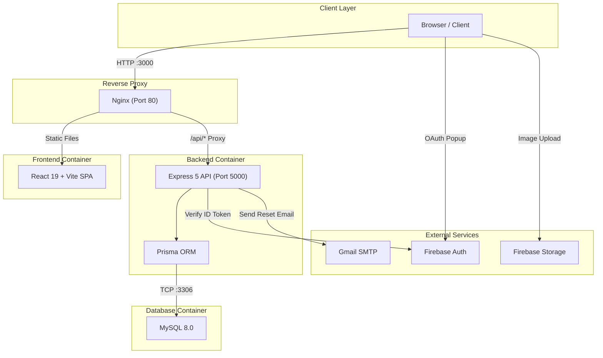
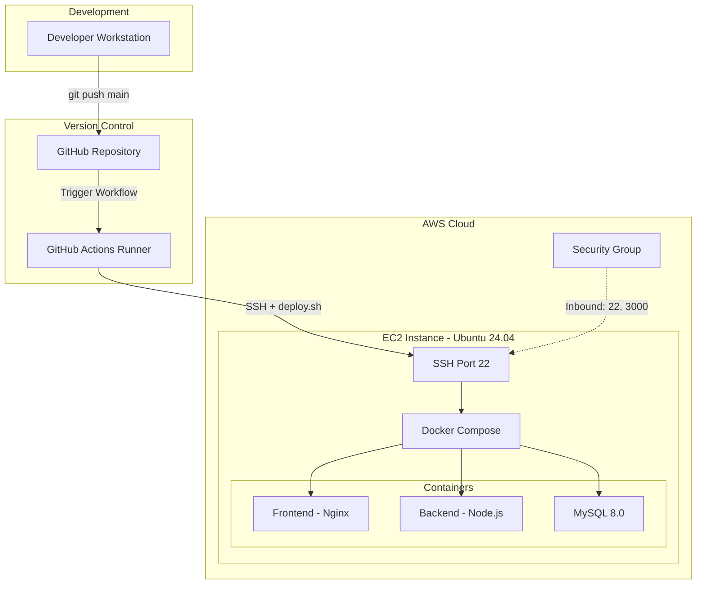
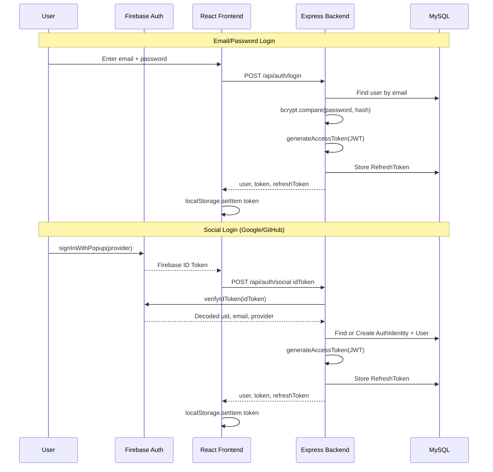
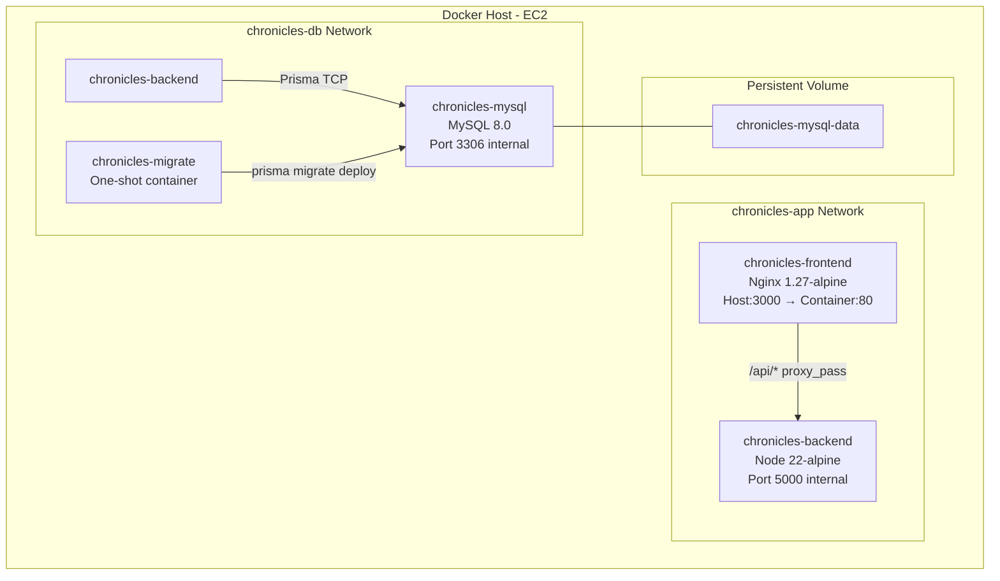
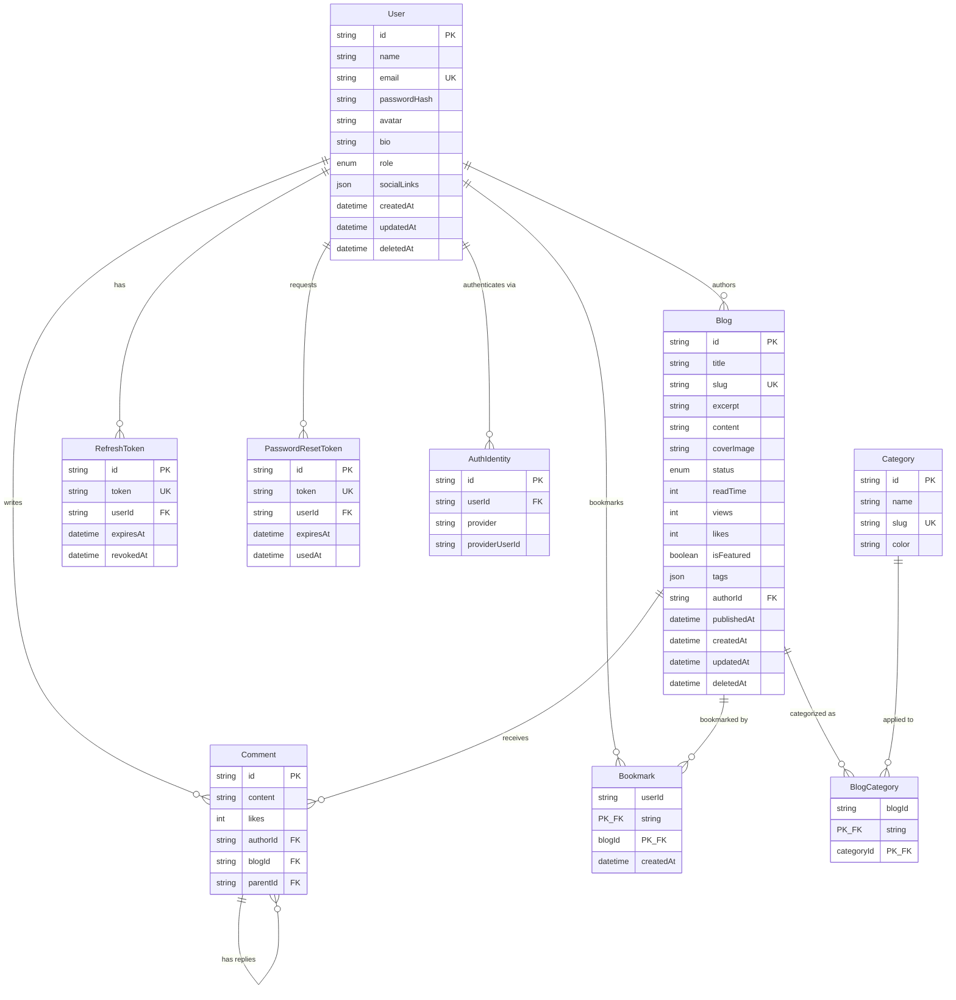
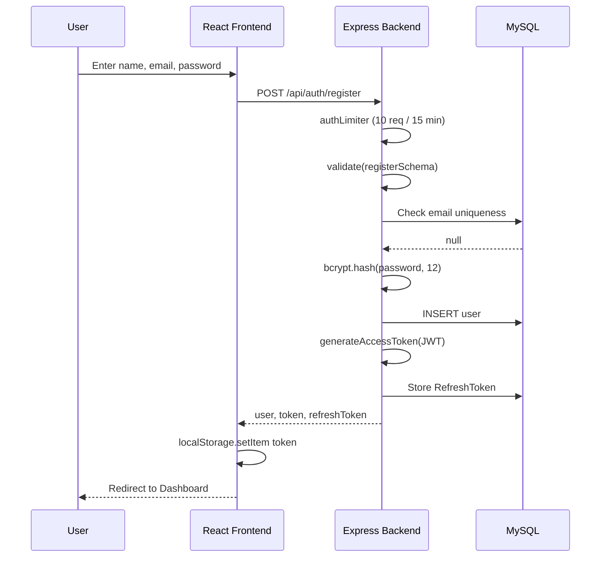
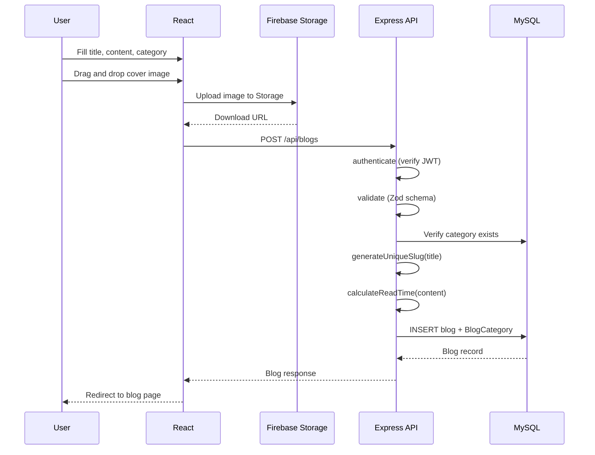
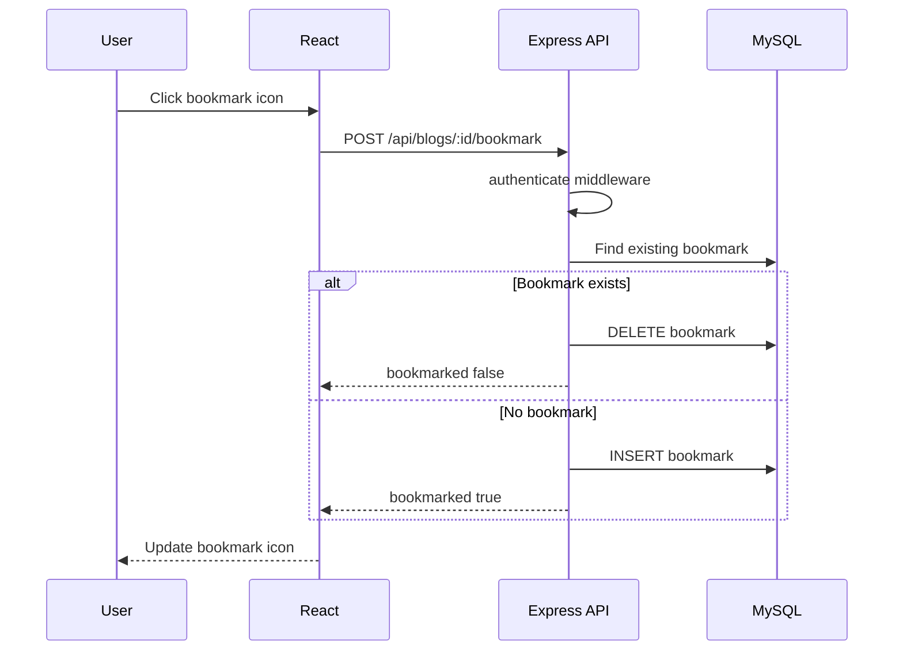
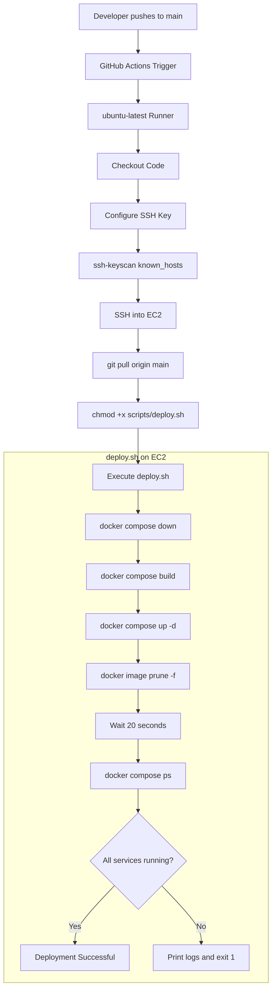
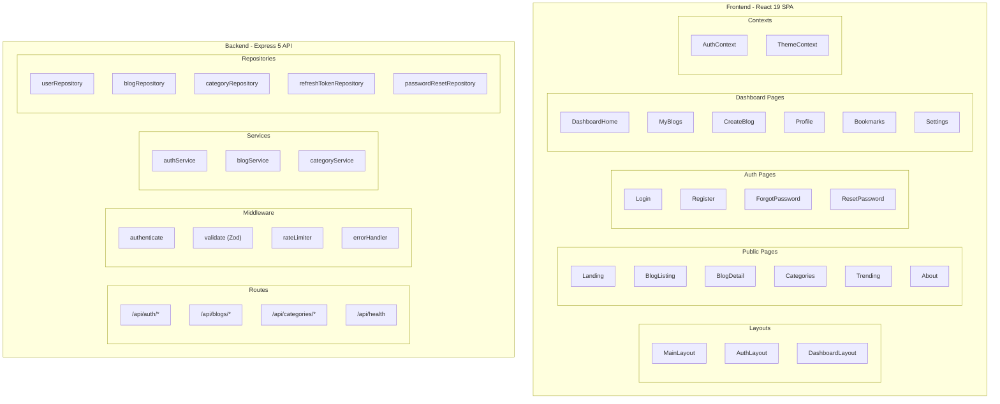

<br/>
<div align="center">

# CHRONICLES

### Modern Full-Stack Blogging Platform

---

**A Major Project Report**

Submitted in partial fulfilment of the requirements for the degree of

**Bachelor of Technology**

in

**Computer Science and Engineering**

---

**Submitted by:**

| Field | Details |
|---|---|
| **Student Name** | *[Your Name]* |
| **Registration Number** | *[Your Registration Number]* |
| **University** | *[Your University Name]* |
| **Department** | Department of Computer Science and Engineering |
| **Project Guide** | *[Guide Name and Designation]* |
| **Submission Date** | July 2026 |

---

</div>

<div style="page-break-after: always;"></div>

---

# Certificate

This is to certify that the project entitled **"Chronicles — Modern Full-Stack Blogging Platform"** submitted by **[Student Name]**, bearing Registration Number **[Registration Number]**, is a bonafide record of work carried out under my supervision and guidance in partial fulfilment of the requirements for the award of the degree of **Bachelor of Technology in Computer Science and Engineering** from **[University Name]**.

The contents of this report have not been submitted to any other university or institute for the award of any degree or diploma.

<br/><br/>

| | |
|---|---|
| **Project Guide** | **Head of Department** |
| *[Guide Name]* | *[HOD Name]* |
| *[Designation]* | *[Designation]* |
| Department of CSE | Department of CSE |
| Date: ____________ | Date: ____________ |

<br/><br/>

**External Examiner:**

Name: ____________________________

Signature: ________________________

Date: ____________

<div style="page-break-after: always;"></div>

---

# Acknowledgement

I would like to express my sincere gratitude to my project guide, **[Guide Name]**, for their invaluable guidance, constant encouragement, and thoughtful feedback throughout the development of this project. Their expertise in software engineering and web technologies was instrumental in shaping the direction and quality of this work.

I am deeply grateful to the **Head of the Department of Computer Science and Engineering**, **[HOD Name]**, for providing the necessary infrastructure and academic environment that made this project possible.

I extend my heartfelt thanks to all the faculty members of the Department of Computer Science and Engineering for the foundational knowledge they imparted during the course of my studies, which served as the bedrock for this project.

I would also like to acknowledge the open-source community and the developers behind React, Express.js, Prisma, Docker, Firebase, and GitHub Actions, whose excellent tools and documentation enabled the realization of this platform.

Finally, I am thankful to my family and friends for their unwavering support and motivation throughout this journey.

<div style="page-break-after: always;"></div>

---

# Abstract

The rapid growth of digital content creation has led to an increasing demand for performant, scalable, and user-friendly blogging platforms. Traditional content management systems such as WordPress, while widely adopted, often suffer from monolithic architectures, security vulnerabilities arising from plugin ecosystems, and difficulty in adopting modern development workflows such as containerized deployment and continuous integration.

**Chronicles** is a modern, full-stack blogging platform designed and built from the ground up to address these limitations. The platform provides a rich, responsive single-page application (SPA) for content creation and consumption, backed by a type-safe RESTful API and a relational database.

**Key Objectives:**
- Build a production-grade, full-stack web application using a modern TypeScript-centric technology stack.
- Implement robust authentication supporting both email/password credentials and social login (Google, GitHub) via Firebase Authentication.
- Design a normalized relational database schema with Prisma ORM for type-safe data access.
- Containerize the entire application using Docker and Docker Compose for reproducible deployments.
- Deploy to AWS EC2 and automate the release cycle with a GitHub Actions CI/CD pipeline.

**Technology Stack:** The frontend is built with React 19, Vite, TailwindCSS 4, and React Router 7. The backend uses Express 5, Prisma ORM, and MySQL 8.0, with Firebase Admin SDK for social token verification. The application is containerized with multi-stage Docker builds and orchestrated via Docker Compose. Continuous deployment is automated through GitHub Actions, which triggers a remote deployment script on an AWS EC2 instance via SSH.

**Outcomes:** The resulting platform is a fully functional, production-deployed blogging application featuring blog creation with a rich text editor, category and tag management, bookmark and trending systems, dark/light theme support, user profile management, and a complete password reset flow via email. The system is deployed on AWS EC2 with automated zero-downtime deployments triggered on every push to the `main` branch.

<div style="page-break-after: always;"></div>

---

# Table of Contents

- [Chapter 1: Introduction](#chapter-1-introduction)
  - [1.1 Problem Statement](#11-problem-statement)
  - [1.2 Need for the System](#12-need-for-the-system)
  - [1.3 Objectives](#13-objectives)
  - [1.4 Scope](#14-scope)
  - [1.5 Expected Outcomes](#15-expected-outcomes)
- [Chapter 2: Literature Survey](#chapter-2-literature-survey)
  - [2.1 Existing Platforms](#21-existing-platforms)
  - [2.2 Comparative Analysis](#22-comparative-analysis)
  - [2.3 Advantages of Chronicles](#23-advantages-of-chronicles)
- [Chapter 3: System Analysis](#chapter-3-system-analysis)
  - [3.1 Functional Requirements](#31-functional-requirements)
  - [3.2 Non-Functional Requirements](#32-non-functional-requirements)
  - [3.3 User Roles](#33-user-roles)
  - [3.4 Use Cases](#34-use-cases)
  - [3.5 Constraints](#35-constraints)
  - [3.6 Assumptions](#36-assumptions)
- [Chapter 4: System Design](#chapter-4-system-design)
  - [4.1 Overall Architecture](#41-overall-architecture)
  - [4.2 Deployment Architecture](#42-deployment-architecture)
  - [4.3 Authentication Flow](#43-authentication-flow)
  - [4.4 Docker Architecture](#44-docker-architecture)
  - [4.5 Database ER Diagram](#45-database-er-diagram)
  - [4.6 Sequence Diagrams](#46-sequence-diagrams)
  - [4.7 CI/CD Pipeline](#47-cicd-pipeline)
  - [4.8 Component Diagram](#48-component-diagram)
  - [4.9 Directory Structure](#49-directory-structure)
- [Chapter 5: Technology Stack](#chapter-5-technology-stack)
- [Chapter 6: Implementation](#chapter-6-implementation)
- [Chapter 7: Database Design](#chapter-7-database-design)
- [Chapter 8: Security](#chapter-8-security)
- [Chapter 9: Testing](#chapter-9-testing)
- [Chapter 10: Deployment](#chapter-10-deployment)
- [Chapter 11: Results](#chapter-11-results)
- [Chapter 12: Future Enhancements](#chapter-12-future-enhancements)
- [Chapter 13: Conclusion](#chapter-13-conclusion)
- [References](#references)
- [Appendices](#appendices)

<div style="page-break-after: always;"></div>

---

# Chapter 1: Introduction

## 1.1 Problem Statement

The modern web demands content platforms that are fast, secure, and maintainable. Traditional blogging solutions like WordPress rely on monolithic PHP architectures with server-rendered pages, extensive plugin dependencies, and shared hosting environments. These designs introduce several problems:

1. **Performance degradation** due to server-side rendering on every request and bloated plugin stacks.
2. **Security vulnerabilities** arising from a vast ecosystem of third-party plugins with inconsistent maintenance.
3. **Difficult DevOps workflows** — deploying changes requires manual FTP uploads or SSH sessions, with no built-in CI/CD pipeline.
4. **Tight coupling** between the content layer and the presentation layer, making it difficult to serve content across multiple clients (web, mobile, API consumers).

Chronicles was conceived to solve these problems by building a blogging platform that treats the frontend and backend as independent, stateless services, connected through a well-defined REST API, and deployed as Docker containers with a fully automated CI/CD pipeline.

## 1.2 Need for the System

- **Decoupled Architecture**: A clear separation between the React SPA frontend and the Express API backend enables independent scaling, testing, and deployment of each layer.
- **Type Safety End-to-End**: Using TypeScript on both the frontend and backend, along with Zod for runtime validation and Prisma for type-safe database queries, eliminates entire classes of bugs at compile time.
- **Modern Authentication**: Supporting Firebase-based social logins (Google, GitHub) alongside traditional email/password authentication provides a flexible, industry-standard authentication flow.
- **Containerized Deployment**: Docker containers guarantee that the application behaves identically in development and production, eliminating the "works on my machine" problem.
- **Automated Deployments**: A GitHub Actions CI/CD pipeline ensures that every push to `main` is automatically built, tested, and deployed to the production EC2 instance without human intervention.

## 1.3 Objectives

1. Design and develop a full-stack blogging platform with a React 19 SPA and an Express 5 REST API.
2. Implement hybrid authentication using Firebase (Google/GitHub social login) and JWT-based session management.
3. Create a normalized relational database schema using Prisma ORM on MySQL 8.0.
4. Containerize all services (frontend, backend, database, migrations) using multi-stage Docker builds.
5. Deploy the application to AWS EC2 using Docker Compose.
6. Automate the deployment lifecycle with GitHub Actions CI/CD.
7. Implement security best practices: Helmet.js headers, CORS, rate limiting, bcrypt password hashing, and environment-based secret management.

## 1.4 Scope

The scope of this project covers:

- **User Management**: Registration, login (email and social), profile management, password change, and password reset via email.
- **Content Management**: Blog creation with a rich text editor, cover image upload (via Firebase Storage), category assignment, tag management, draft/publish workflow, and soft deletion.
- **Content Discovery**: Blog listing with search, category filtering, pagination, trending blogs (based on views within 7 days), featured blogs, and bookmark management.
- **Commenting**: Threaded comments with nested replies (self-referencing parent-child relationship).
- **Theming**: Dark mode and light mode toggle with localStorage persistence.
- **DevOps**: Docker Compose orchestration, multi-stage Docker builds, Nginx reverse proxy, and GitHub Actions CI/CD.

The following areas are explicitly out of scope for this version:
- Real-time notifications (WebSocket)
- Rich text formatting (WYSIWYG editor)
- Admin dashboard for content moderation
- HTTPS/TLS certificate management (planned for future phases)

## 1.5 Expected Outcomes

1. A fully functional, deployed blogging platform accessible via a public IP address on AWS EC2.
2. A clean, maintainable codebase organized into a layered architecture (Controllers → Services → Repositories → Prisma → MySQL).
3. Automated deployments triggered by every push to the `main` branch.
4. A comprehensive security posture covering authentication, authorization, input validation, rate limiting, and secret management.
5. Production-quality Docker configuration with health checks, graceful shutdowns, and volume persistence.

<div style="page-break-after: always;"></div>

---

# Chapter 2: Literature Survey

## 2.1 Existing Platforms

### 2.1.1 Medium

Medium is a proprietary blogging platform known for its clean reading experience. However, it lacks self-hosting capabilities, limits free articles behind a paywall, and provides no control over the underlying technology stack. Content creators are locked into Medium's ecosystem with no ability to customize the platform or own their data infrastructure.

### 2.1.2 Dev.to

Dev.to is an open-source community platform built on Ruby on Rails (Forem). While it provides an excellent developer community, its monolithic Rails architecture makes self-hosting complex. The platform is optimized for community-driven content rather than individual blogging needs, and customization requires deep knowledge of the Ruby ecosystem.

### 2.1.3 Hashnode

Hashnode offers a headless CMS approach with a GraphQL API. While modern in its API design, Hashnode is primarily a hosted service. Self-hosting requires their enterprise plan. The platform's strength is its community features, but it provides limited control over the deployment infrastructure.

### 2.1.4 Traditional CMS (WordPress)

WordPress powers over 40% of the web but carries significant technical debt. Its PHP-based architecture, reliance on server-side rendering, and vast plugin ecosystem create security and performance challenges. Deploying WordPress in a containerized, CI/CD-driven workflow requires significant custom tooling that the platform was not designed for.

## 2.2 Comparative Analysis

| Feature | Chronicles | Medium | Dev.to | Hashnode | WordPress |
|---|---|---|---|---|---|
| **Architecture** | Decoupled SPA + REST API | Monolithic | Monolithic (Rails) | Headless CMS | Monolithic (PHP) |
| **Language** | TypeScript (full-stack) | Proprietary | Ruby + JS | Node.js + GraphQL | PHP |
| **Self-Hosting** | ✅ Full control | ❌ | ⚠️ Complex | ⚠️ Enterprise only | ✅ |
| **Containerized** | ✅ Docker Compose | ❌ | ⚠️ Manual | ❌ | ⚠️ Manual |
| **CI/CD Built-in** | ✅ GitHub Actions | N/A | ❌ | ❌ | ❌ |
| **Social Auth** | ✅ Firebase (Google, GitHub) | ✅ | ✅ | ✅ | ⚠️ Plugin |
| **Type Safety** | ✅ End-to-end TypeScript | N/A | ❌ | Partial | ❌ |
| **API-First** | ✅ REST API | ❌ | Partial | ✅ GraphQL | ⚠️ REST Plugin |
| **ORM** | Prisma (type-safe) | N/A | ActiveRecord | N/A | None (raw SQL) |

## 2.3 Advantages of Chronicles

1. **Full-Stack TypeScript**: A single language across the entire stack reduces context switching, enables shared type definitions, and catches errors at compile time.
2. **API-First Design**: The decoupled architecture allows the React frontend to be replaced with any client (mobile app, CLI, third-party integration) without modifying the backend.
3. **Production-Ready DevOps**: Docker Compose with health checks, multi-stage builds, Nginx reverse proxy, and automated GitHub Actions deployments — all built into the project from the beginning, not bolted on as an afterthought.
4. **Modern Security Stack**: Firebase for social authentication, bcrypt for password hashing, JWT for stateless session management, Helmet.js for security headers, Zod for input validation, and tiered rate limiting — all implemented as first-class concerns.
5. **Reproducible Environments**: Docker containers ensure that development, staging, and production environments are byte-identical, eliminating environment-specific bugs.

<div style="page-break-after: always;"></div>

---

# Chapter 3: System Analysis

## 3.1 Functional Requirements

### FR-1: User Authentication
- Users can register with name, email, and password.
- Users can log in with email/password or via Google/GitHub social login (Firebase).
- The system issues JWT access tokens (15-minute expiry) and refresh tokens (7-day expiry).
- Users can log out, which revokes all refresh tokens.
- Users can request a password reset via email.

### FR-2: Blog Management
- Authenticated users can create blog posts with title, content, excerpt, cover image, category, tags, and status (draft/published).
- The system auto-generates URL-friendly slugs from titles, appending a random suffix on collision.
- The system auto-calculates estimated read time (words / 200 WPM).
- Authors can edit and soft-delete their own blogs.
- Admin users can edit or delete any blog.

### FR-3: Content Discovery
- Public users can browse published blogs with pagination (default 10 per page).
- Users can search blogs by title, excerpt, or content.
- Users can filter by category.
- Sorting options: latest (by publish date), popular (by views), trending (views within 7 days).
- The landing page displays featured blogs and trending blogs.

### FR-4: Bookmarking
- Authenticated users can bookmark/unbookmark blogs (toggle operation).
- Users can view all their bookmarked blogs from the dashboard.

### FR-5: Commenting
- Authenticated users can comment on published blogs.
- Comments support nested replies (self-referencing `parentId`).
- Soft deletion is supported for comments.

### FR-6: User Profile
- Users can view and update their profile (name, bio, avatar, social links).
- Users can change their password (requires current password verification).

### FR-7: Theming
- Users can toggle between dark mode and light mode.
- Theme preference is persisted in `localStorage`.

## 3.2 Non-Functional Requirements

| ID | Requirement | Implementation |
|---|---|---|
| NFR-1 | **Performance** | Nginx gzip compression, static asset caching (1 year), React SPA (no full page reloads) |
| NFR-2 | **Security** | Helmet.js security headers, CORS whitelist, bcrypt (12 salt rounds), JWT, rate limiting |
| NFR-3 | **Scalability** | Stateless backend (horizontal scaling possible), Docker containers |
| NFR-4 | **Reliability** | Docker health checks, graceful shutdown handlers (SIGTERM/SIGINT), container restart policies |
| NFR-5 | **Maintainability** | Layered architecture (Controller → Service → Repository), TypeScript, Zod validation |
| NFR-6 | **Portability** | Docker containers, environment variable configuration, no hardcoded secrets |
| NFR-7 | **Availability** | `restart: unless-stopped` policy on all Docker services, automated CI/CD re-deployment |

## 3.3 User Roles

The system defines two roles in the `Role` enum within the Prisma schema:

| Role | Permissions |
|---|---|
| **USER** | Register, login, create/edit/delete own blogs, comment, bookmark, manage profile |
| **ADMIN** | All USER permissions + edit/delete any blog |

Authorization is enforced by the `authorize()` middleware, which checks `req.user.role` against the required roles for a given route.

## 3.4 Use Cases

| # | Use Case | Actor | Description |
|---|---|---|---|
| UC-1 | Register Account | Guest | User creates an account with name, email, and password |
| UC-2 | Social Login | Guest | User logs in via Google or GitHub popup |
| UC-3 | Create Blog | USER | Author writes a blog with title, content, category, cover image |
| UC-4 | Browse Blogs | Guest/USER | User browses published blogs with search, filter, sort |
| UC-5 | Read Blog | Guest/USER | User reads a blog; view count increments |
| UC-6 | Bookmark Blog | USER | User bookmarks a blog for later reading |
| UC-7 | Comment on Blog | USER | User writes a comment or replies to an existing comment |
| UC-8 | Manage Profile | USER | User updates name, bio, avatar, social links |
| UC-9 | Reset Password | Guest | User requests a password reset email and sets a new password |
| UC-10 | Delete Blog | USER/ADMIN | Author or admin soft-deletes a blog |

## 3.5 Constraints

1. **Database**: The system uses MySQL 8.0 as the sole relational database. No NoSQL or caching layer is currently implemented.
2. **Image Storage**: Cover images are uploaded to Firebase Storage from the client side. The backend only stores the resulting download URL.
3. **Email**: Password reset emails are sent via Gmail SMTP. The system requires a valid Gmail app password.
4. **Single Region**: The application is deployed to a single AWS EC2 instance. No multi-region or load-balanced deployment is implemented.

## 3.6 Assumptions

1. The user has a modern browser that supports ES2020+ JavaScript.
2. Docker and Docker Compose are available on the deployment target.
3. A Firebase project is configured with Google and GitHub sign-in providers enabled.
4. The EC2 instance has sufficient resources (at least 2 GB RAM recommended for Docker builds).

<div style="page-break-after: always;"></div>

---

# Chapter 4: System Design

This chapter presents the architectural diagrams that describe the Chronicles system. All diagrams are generated using Mermaid and are available as standalone `.mmd` files in the `docs/diagrams/` directory.

## 4.1 Overall Architecture

The Chronicles platform follows a three-tier architecture with an Nginx reverse proxy fronting a React SPA and an Express API backed by MySQL.



**Design Rationale**: Nginx serves dual purpose — it delivers the pre-built React static assets for all non-API routes and reverse-proxies `/api/*` requests to the Express backend. This means the browser makes all requests to a single origin (port 3000), eliminating CORS issues in production and allowing the backend to remain on an internal Docker network without exposing its port to the host.

## 4.2 Deployment Architecture



## 4.3 Authentication Flow

The application implements a dual authentication strategy: traditional email/password login and Firebase-based social login. Both flows converge into the same session management system (JWT access + refresh tokens).



**Design Decision**: Firebase handles the OAuth popup flow and provider-specific token exchange on the client side. The backend only receives and verifies the Firebase ID token, meaning the backend never handles OAuth credentials directly. This significantly reduces the attack surface and implementation complexity.

## 4.4 Docker Architecture



**Key Design Decisions:**
- **Two isolated networks**: `chronicles-app` (frontend ↔ backend) and `chronicles-db` (backend ↔ database). The frontend container cannot reach the database directly.
- **One-shot migration container**: The `chronicles-migrate` service runs `prisma migrate deploy` and then exits. The backend waits for it to complete successfully (`service_completed_successfully`) before starting.
- **Named volume**: `chronicles-mysql-data` persists database files across container recreations.
- **Multi-stage builds**: Both frontend and backend Dockerfiles use multi-stage builds to keep runtime images minimal (Node 22-alpine for backend, Nginx 1.27-alpine for frontend).

## 4.5 Database ER Diagram

The database schema consists of 9 tables, designed using Prisma ORM and deployed to MySQL 8.0.



## 4.6 Sequence Diagrams

### 4.6.1 Registration Flow



### 4.6.2 Create Blog Flow



### 4.6.3 Bookmark Toggle Flow



## 4.7 CI/CD Pipeline



## 4.8 Component Diagram



## 4.9 Directory Structure

```
chronicles/
├── .github/
│   └── workflows/
│       └── deploy.yml                 # GitHub Actions CI/CD workflow
├── backend/
│   ├── prisma/
│   │   ├── schema.prisma              # Database schema (9 models)
│   │   ├── migrations/                # SQL migration files
│   │   └── seed.ts                    # Database seeder
│   ├── src/
│   │   ├── config/
│   │   │   ├── database.ts            # Prisma client singleton
│   │   │   ├── env.ts                 # Zod-validated environment config
│   │   │   └── firebaseAdmin.ts       # Firebase Admin SDK init
│   │   ├── controllers/
│   │   │   ├── auth.controller.ts     # Auth endpoint handlers
│   │   │   ├── blog.controller.ts     # Blog endpoint handlers
│   │   │   └── category.controller.ts # Category endpoint handlers
│   │   ├── middleware/
│   │   │   ├── auth.middleware.ts      # JWT auth + optional auth + RBAC
│   │   │   ├── error.middleware.ts     # Global error handler
│   │   │   ├── rateLimiter.middleware.ts # Tiered rate limiting
│   │   │   └── validate.middleware.ts  # Zod validation factory
│   │   ├── repositories/
│   │   │   ├── blog.repository.ts     # Blog data access layer
│   │   │   ├── category.repository.ts # Category data access
│   │   │   ├── user.repository.ts     # User data access
│   │   │   ├── refreshToken.repository.ts
│   │   │   └── passwordReset.repository.ts
│   │   ├── routes/
│   │   │   ├── index.ts               # Route aggregator + health check
│   │   │   ├── auth.routes.ts         # Auth route definitions
│   │   │   ├── blog.routes.ts         # Blog route definitions
│   │   │   └── category.routes.ts     # Category route definitions
│   │   ├── schemas/
│   │   │   ├── auth.schema.ts         # Zod schemas for auth inputs
│   │   │   └── blog.schema.ts         # Zod schemas for blog inputs
│   │   ├── services/
│   │   │   ├── auth.service.ts        # Auth business logic
│   │   │   ├── blog.service.ts        # Blog business logic
│   │   │   └── category.service.ts    # Category business logic
│   │   ├── types/
│   │   │   └── index.ts               # Shared TypeScript interfaces
│   │   ├── utils/
│   │   │   ├── apiResponse.ts         # Standardized API responses
│   │   │   ├── email.ts               # Nodemailer + password reset emails
│   │   │   ├── errors.ts              # Custom error class hierarchy
│   │   │   ├── jwt.ts                 # JWT sign/verify utilities
│   │   │   └── slug.ts               # Slug generation + read time calc
│   │   ├── app.ts                     # Express app setup + middleware
│   │   └── server.ts                  # Bootstrap, DB connect, graceful shutdown
│   ├── Dockerfile                     # Multi-stage build (build → runtime)
│   ├── docker-entrypoint.sh           # Migration + seed script
│   └── package.json
├── frontend/
│   ├── src/
│   │   ├── components/                # 14 shared UI components
│   │   ├── config/
│   │   │   └── firebase.ts            # Firebase client SDK init
│   │   ├── contexts/
│   │   │   ├── AuthContext.tsx         # Auth state management
│   │   │   └── ThemeContext.tsx        # Dark/light theme state
│   │   ├── hooks/
│   │   │   └── useDebounce.ts         # Debounce hook for search
│   │   ├── layouts/
│   │   │   ├── MainLayout.tsx         # Public pages layout
│   │   │   ├── AuthLayout.tsx         # Login/register layout
│   │   │   └── DashboardLayout.tsx    # Dashboard layout with sidebar
│   │   ├── pages/                     # 17 page components
│   │   ├── routes/
│   │   │   └── index.tsx              # React Router v7 configuration
│   │   ├── services/
│   │   │   ├── api.ts                 # Fetch-based API client
│   │   │   ├── authService.ts         # Auth API calls
│   │   │   ├── blogService.ts         # Blog API calls
│   │   │   ├── categoryService.ts     # Category API calls
│   │   │   ├── socialAuthService.ts   # Firebase social auth
│   │   │   └── storageService.ts      # Firebase Storage uploads
│   │   ├── types/                     # Frontend TypeScript types
│   │   ├── utils/                     # Constants, formatters
│   │   ├── App.tsx                    # Root component
│   │   ├── main.tsx                   # Entry point
│   │   └── index.css                  # Global styles + theme variables
│   ├── Dockerfile                     # Multi-stage (Vite build → Nginx)
│   ├── nginx.conf                     # Nginx config: SPA + API proxy
│   └── package.json
├── scripts/
│   └── deploy.sh                      # EC2 deployment script
├── docs/
│   ├── architecture.md                # Architecture documentation
│   ├── diagrams/                      # Mermaid diagram source files
│   └── phase-*.md                     # Phase completion reports
├── docker-compose.yml                 # Service orchestration (4 services)
├── .env.example                       # Environment variable template
└── .gitignore
```

<div style="page-break-after: always;"></div>

---

# Chapter 5: Technology Stack

## 5.1 Frontend Technologies

| Technology | Version | Purpose |
|---|---|---|
| **React** | 19.0.0 | UI component library with functional components and hooks |
| **Vite** | 6.3.5 | Build tool with HMR for development and optimized production builds |
| **TypeScript** | 5.7.3 | Static type checking across the entire frontend codebase |
| **TailwindCSS** | 4.1.8 | Utility-first CSS framework for responsive design |
| **React Router** | 7.5.0 | Client-side routing with nested layouts and SPA navigation |
| **React Hook Form** | 7.55.0 | Performant form management with uncontrolled components |
| **Zod** | 3.24.2 | Schema-based form validation (shared with backend) |
| **TanStack React Query** | 5.75.5 | Server-state management with caching, background refetching |
| **Framer Motion** | 12.15.0 | Animation library for page transitions and micro-interactions |
| **Lucide React** | 0.475.0 | Open-source SVG icon library |
| **Firebase Client SDK** | 12.15.0 | Social authentication (Google/GitHub popup) and Storage |

## 5.2 Backend Technologies

| Technology | Version | Purpose |
|---|---|---|
| **Node.js** | 22 (Alpine) | JavaScript runtime for the API server |
| **Express** | 5.1.0 | Minimal HTTP framework for RESTful APIs |
| **TypeScript** | 5.8.3 | Static type checking and compile-time safety |
| **Prisma ORM** | 6.9.0 | Type-safe database client with auto-generated types and migrations |
| **MySQL** | 8.0 | Relational database for structured data storage |
| **Firebase Admin SDK** | 13.10.0 | Server-side verification of Firebase ID tokens |
| **JSON Web Tokens** | 9.0.2 | Stateless authentication via signed access/refresh tokens |
| **bcrypt** | 5.1.1 | Password hashing with configurable salt rounds (12) |
| **Helmet** | 8.1.0 | HTTP security headers (CSP, HSTS, X-Frame-Options, etc.) |
| **CORS** | 2.8.5 | Cross-Origin Resource Sharing middleware |
| **express-rate-limit** | 7.5.0 | Tiered rate limiting (global, auth, password reset) |
| **Zod** | 3.25.36 | Runtime input validation for API request bodies/params/queries |
| **Nodemailer** | 6.10.1 | Email transport for password reset functionality |
| **Slugify** | 1.6.6 | URL-friendly slug generation from blog titles |
| **Morgan** | 1.10.0 | HTTP request logging middleware |

## 5.3 DevOps Technologies

| Technology | Purpose |
|---|---|
| **Docker** | Application containerization with multi-stage builds |
| **Docker Compose** | Multi-container orchestration (frontend, backend, MySQL, migrate) |
| **Nginx** | Reverse proxy, static file serving, gzip compression |
| **AWS EC2** | Ubuntu 24.04 LTS cloud compute instance |
| **GitHub Actions** | CI/CD pipeline triggered on push to `main` |
| **SSH** | Secure remote access for automated deployments |

<div style="page-break-after: always;"></div>

---

# Chapter 6: Implementation

## 6.1 Frontend Implementation

### 6.1.1 Application Structure

The React frontend uses a layout-based routing architecture with `react-router-dom` v7. Three layout components define the structural regions of the application:

- **MainLayout**: Used for public pages (Landing, BlogListing, BlogDetail, Categories, Trending, About). Includes the Navbar and Footer.
- **AuthLayout**: Used for authentication pages (Login, Register, ForgotPassword, ResetPassword). Provides a centered, focused layout without navigation.
- **DashboardLayout**: Used for authenticated user pages (DashboardHome, MyBlogs, CreateBlog, Profile, Bookmarks, Settings). Includes a sidebar navigation.

### 6.1.2 API Client

The frontend communicates with the backend through a lightweight `fetch`-based API client (`services/api.ts`):

```typescript
async function request<T>(endpoint: string, options?: RequestInit): Promise<T> {
  const token = localStorage.getItem('chronicles-token');
  const res = await fetch(`${API_BASE_URL}${endpoint}`, {
    headers: {
      'Content-Type': 'application/json',
      ...(token && { Authorization: `Bearer ${token}` }),
    },
    ...options,
  });
  if (!res.ok) {
    const error = await res.json().catch(() => ({ message: 'Request failed' }));
    throw new Error(error.message || `HTTP ${res.status}`);
  }
  const json = await res.json();
  return json.data !== undefined ? json.data : json;
}
```

This wrapper automatically attaches the JWT access token from `localStorage` to every request and unwraps the standardized `{ success, data, message }` API response format.

### 6.1.3 Authentication Context

The `AuthContext` manages global authentication state and provides `login`, `register`, `loginWithGoogle`, `loginWithGitHub`, and `logout` methods to all child components. On application mount, it checks for an existing token in `localStorage` and attempts to restore the session by calling `GET /api/auth/me`.

### 6.1.4 Theme System

The `ThemeContext` implements a dark/light mode toggle. The active theme is persisted to `localStorage` and applied by toggling a `dark` or `light` class on the `<body>` element. CSS variables defined in `index.css` are overridden based on the active theme class, enabling glassmorphism effects and proper color adaptation across both modes.

### 6.1.5 Cover Image Upload

The blog creation page supports drag-and-drop cover image uploads via Firebase Storage. The `storageService.ts` module uploads the file directly from the browser to Firebase and returns the public download URL, which is then included in the blog creation API request.

## 6.2 Backend Implementation

### 6.2.1 Layered Architecture

The backend follows a strict four-layer architecture:

```
Controller → Service → Repository → Prisma → MySQL
```

- **Controllers** handle HTTP request/response concerns only. They extract parameters, call services, and format responses.
- **Services** contain all business logic — validation rules, authorization checks, slug generation, read-time calculation, and data transformation.
- **Repositories** are thin data-access wrappers around Prisma that encapsulate query construction and relationship includes.
- **Prisma** generates a type-safe database client from the schema, handling SQL generation and connection pooling.

### 6.2.2 Middleware Pipeline

The Express middleware is applied in a specific order in `app.ts`:

```typescript
app.use(helmet());           // 1. Security headers
app.use(cors({ origin }));   // 2. CORS whitelist
app.use(morgan(...));        // 3. Request logging
app.use(express.json());     // 4. Body parsing (10kb limit)
app.use(cookieParser());     // 5. Cookie parsing
app.use('/api', globalLimiter); // 6. Rate limiting (100 req / 15 min)
app.use('/api', routes);     // 7. API routes
app.use(errorHandler);       // 8. Global error handler
```

### 6.2.3 Authentication Service

The `authService` implements six authentication operations:

1. **`register`**: Validates input → checks email uniqueness → hashes password (bcrypt, 12 rounds) → creates user → issues tokens.
2. **`login`**: Finds user → compares password hash → issues tokens.
3. **`socialLogin`**: Verifies Firebase ID token → finds or creates `AuthIdentity` → issues tokens.
4. **`refreshToken`**: Validates refresh token → revokes old token → issues new token pair (rotation).
5. **`forgotPassword`**: Generates reset token → stores hashed token → sends email via Nodemailer.
6. **`resetPassword`**: Validates reset token → hashes new password → revokes all refresh tokens.

### 6.2.4 Blog Service

The `blogService` handles content lifecycle operations:

- **Slug Generation**: Uses `slugify` to create URL-friendly slugs. If a collision is detected in the database, a random 6-character alphanumeric suffix is appended.
- **Read Time Calculation**: Counts words in the content and divides by 200 (average reading speed), with a minimum of 1 minute.
- **Trending Logic**: Filters published blogs with views within the last 7 days and orders by view count.
- **Featured Fallback**: If no blogs are explicitly marked as `isFeatured`, falls back to the most recently published blogs.
- **Soft Deletion**: Sets `deletedAt` timestamp instead of hard-deleting records.

### 6.2.5 Input Validation

All API inputs are validated using Zod schemas. The `validate` middleware factory accepts schemas for `body`, `query`, and `params`:

```typescript
router.post('/',
  validate({ body: createBlogSchema }),
  blogController.createBlog
);
```

Invalid requests receive a `422` response with field-level error details.

### 6.2.6 Error Handling

A custom error hierarchy extends `Error`:

| Class | Status Code | Use Case |
|---|---|---|
| `BadRequestError` | 400 | Invalid input that passes Zod but fails business rules |
| `UnauthorizedError` | 401 | Missing or invalid JWT |
| `ForbiddenError` | 403 | Insufficient role permissions |
| `NotFoundError` | 404 | Resource not found |
| `ConflictError` | 409 | Duplicate email, existing resource |
| `ValidationError` | 422 | Zod schema validation failures |
| `TooManyRequestsError` | 429 | Rate limit exceeded |

The global error handler in `error.middleware.ts` catches all errors, including Prisma-specific errors (`P2002` for unique constraint, `P2025` for not found) and JWT errors, and returns standardized JSON responses.

### 6.2.7 Graceful Shutdown

The `server.ts` bootstrap function registers handlers for `SIGTERM` and `SIGINT`:

```typescript
const gracefulShutdown = async () => {
  server.close(async () => {
    await prisma.$disconnect();
    process.exit(0);
  });
  setTimeout(() => process.exit(1), 10000); // Force after 10s
};
process.on('SIGTERM', gracefulShutdown);
process.on('SIGINT', gracefulShutdown);
```

This ensures in-flight requests complete and database connections are properly closed before the process exits, which is critical in a Docker environment where containers are stopped with `SIGTERM`.

<div style="page-break-after: always;"></div>

---

# Chapter 7: Database Design

## 7.1 Schema Overview

The database consists of 9 models defined in `backend/prisma/schema.prisma` and deployed to MySQL 8.0. The schema uses the following Prisma features:

- **UUIDs** for all primary keys (generated by `@default(uuid())`)
- **Enums** for `Role` (USER, ADMIN) and `BlogStatus` (DRAFT, PUBLISHED, ARCHIVED)
- **Composite primary keys** for junction tables (`BlogCategory`, `Bookmark`)
- **Self-referencing relationships** for threaded comments (`Comment.parentId → Comment.id`)
- **Soft deletion** via nullable `deletedAt` timestamps on `User`, `Blog`, and `Comment`
- **Database indexes** on frequently queried columns (`email`, `slug`, `authorId`, `status`, `publishedAt`)

## 7.2 Table Descriptions

### Users (`users`)
Stores registered users. The `passwordHash` field is nullable because social login users may not have a password set. The `socialLinks` field is a JSON column storing arbitrary key-value pairs (e.g., `{ twitter: "...", github: "..." }`).

### Auth Identities (`auth_identities`)
Links social login providers to user accounts. The composite unique constraint `(provider, providerUserId)` ensures each social identity maps to exactly one user. Supports Google and GitHub providers.

### Blogs (`blogs`)
The central content table. Features include:
- `slug`: Unique, URL-friendly identifier auto-generated from the title.
- `status`: DRAFT, PUBLISHED, or ARCHIVED. Only PUBLISHED blogs appear in public listings.
- `readTime`: Auto-calculated minutes based on word count.
- `isFeatured`: Boolean flag for editorial curation.
- `tags`: JSON array of string tags.

### Categories (`categories`)
Stores blog categories with a unique slug and optional hex color code for UI display.

### Blog Categories (`blog_categories`)
Many-to-many junction table linking blogs to categories. Uses a composite primary key `(blogId, categoryId)`.

### Comments (`comments`)
Supports threaded discussions via a self-referencing `parentId`. When a parent comment is deleted, child comments have their `parentId` set to `NULL` (`onDelete: SetNull`) to preserve the thread.

### Refresh Tokens (`refresh_tokens`)
Implements refresh token rotation. Each token is stored with an expiry date and an optional `revokedAt` timestamp. When a refresh token is used, it is immediately revoked and a new one is issued.

### Password Reset Tokens (`password_reset_tokens`)
Stores time-limited tokens for the password reset flow. Tokens expire after 1 hour and are marked as used (`usedAt`) after successful password change.

### Bookmarks (`bookmarks`)
A many-to-many relationship between users and blogs, using a composite primary key `(userId, blogId)`. The toggle operation checks for existence, deleting if present or inserting if absent.

## 7.3 Relationships Summary

| Relationship | Type | Implementation |
|---|---|---|
| User → Blogs | One-to-Many | `Blog.authorId` FK |
| User → Comments | One-to-Many | `Comment.authorId` FK |
| User → Bookmarks | One-to-Many | `Bookmark.userId` FK |
| User → AuthIdentities | One-to-Many | `AuthIdentity.userId` FK |
| User → RefreshTokens | One-to-Many | `RefreshToken.userId` FK |
| User → PasswordResetTokens | One-to-Many | `PasswordResetToken.userId` FK |
| Blog → Categories | Many-to-Many | Via `BlogCategory` junction table |
| Blog → Comments | One-to-Many | `Comment.blogId` FK |
| Blog → Bookmarks | One-to-Many | `Bookmark.blogId` FK |
| Comment → Replies | Self-Referencing | `Comment.parentId` FK to `Comment.id` |

All foreign keys use `onDelete: Cascade` except `Comment.parentId`, which uses `onDelete: SetNull` to preserve reply threads when a parent comment is deleted.

<div style="page-break-after: always;"></div>

---

# Chapter 8: Security

## 8.1 JWT-Based Authentication

The application uses short-lived JWT access tokens (15 minutes) and long-lived refresh tokens (7 days) with rotation. When a refresh token is used to obtain a new access token, the old refresh token is immediately revoked and a new one is issued. This limits the damage window if a refresh token is compromised.

```typescript
// Access token: short-lived, sent in Authorization header
const accessToken = jwt.sign({ userId, role }, JWT_ACCESS_SECRET, { expiresIn: '15m' });

// Refresh token: long-lived, stored in database with expiry
const refreshToken = jwt.sign({ userId, role }, JWT_REFRESH_SECRET, { expiresIn: '7d' });
```

## 8.2 Firebase Authentication

Social login uses Firebase Authentication on the client side. The backend never handles OAuth credentials (client secrets, authorization codes). Instead, it receives the Firebase ID token and verifies it using the Firebase Admin SDK:

```typescript
const decodedToken = await firebaseAdmin.auth().verifyIdToken(idToken);
```

This verification happens server-side and confirms the token was issued by the correct Firebase project.

## 8.3 Password Hashing

Passwords are hashed using bcrypt with 12 salt rounds, which provides approximately 300ms of computation per hash — slow enough to deter brute-force attacks while remaining acceptable for user-facing operations.

## 8.4 Input Validation

All API inputs are validated at the middleware level using Zod schemas before reaching the controller:

- **Registration**: Email format, password minimum length (8 characters), name required.
- **Blog creation**: Title (max 200 chars), content required, valid category ID, status enum.
- **Query parameters**: Page/limit as positive integers, sortBy as enum (`latest`, `popular`, `trending`).

## 8.5 Rate Limiting

Three tiers of rate limiting are implemented using `express-rate-limit`:

| Limiter | Scope | Limit | Window |
|---|---|---|---|
| `globalLimiter` | All `/api` routes | 100 requests | 15 minutes |
| `authLimiter` | Login, register, social login | 10 requests | 15 minutes |
| `passwordResetLimiter` | Forgot password, reset password | 3 requests | 15 minutes |

## 8.6 Security Headers

Helmet.js sets the following HTTP security headers on every response:
- `Content-Security-Policy`
- `X-Content-Type-Options: nosniff`
- `X-Frame-Options: DENY`
- `Strict-Transport-Security`
- `X-XSS-Protection`

## 8.7 CORS Configuration

CORS is configured to allow requests only from the `FRONTEND_URL` environment variable:

```typescript
app.use(cors({ origin: env.FRONTEND_URL, credentials: true }));
```

In production, this restricts API access to requests originating from the deployed frontend domain only.

## 8.8 Environment Variables

All secrets are stored in `.env` files that are excluded from version control via `.gitignore`. The `env.ts` configuration module validates all required environment variables at startup using Zod, and the process exits immediately if any required variable is missing.

## 8.9 Docker Security

- **Non-root user**: The backend container runs as the `node` user (provided by `node:alpine`), not root.
- **Multi-stage builds**: Build dependencies (TypeScript compiler, dev dependencies) are not present in the runtime image.
- **Network isolation**: The frontend container cannot directly access the database; only the backend has access to the `chronicles-db` network.
- **dumb-init**: The backend uses `dumb-init` as PID 1 to properly handle signal forwarding and prevent zombie processes.

## 8.10 GitHub Actions Security

- All deployment credentials (EC2 host, SSH key, username) are stored as GitHub Repository Secrets.
- The SSH private key is written to a file with `chmod 600` permissions and used only during the deployment step.
- Concurrency control ensures that overlapping deployments are cancelled, preventing race conditions.

<div style="page-break-after: always;"></div>

---

# Chapter 9: Testing

## 9.1 Manual Testing

The following manual test cases were executed to verify application functionality:

### 9.1.1 Authentication Test Cases

| # | Test Case | Steps | Expected Result | Status |
|---|---|---|---|---|
| T-1 | User Registration | Fill name, email, password → Submit | User created, redirected to dashboard | ✅ Pass |
| T-2 | Duplicate Email | Register with existing email | Error: "An account with this email already exists" | ✅ Pass |
| T-3 | Email/Password Login | Enter valid credentials → Submit | JWT issued, redirected to dashboard | ✅ Pass |
| T-4 | Invalid Login | Enter wrong password | Error: "Invalid email or password" | ✅ Pass |
| T-5 | Google Login | Click Google button → Complete popup | User created/found, session established | ✅ Pass |
| T-6 | GitHub Login | Click GitHub button → Complete popup | User created/found, session established | ✅ Pass |
| T-7 | Token Refresh | Wait 15 min, make API request | New access token issued transparently | ✅ Pass |
| T-8 | Password Reset | Request reset → Check email → Set new password | Password updated, old sessions revoked | ✅ Pass |
| T-9 | Rate Limiting | Send 11 login requests in 15 min | 429 Too Many Requests after 10th | ✅ Pass |

### 9.1.2 Blog Management Test Cases

| # | Test Case | Steps | Expected Result | Status |
|---|---|---|---|---|
| T-10 | Create Blog | Fill form with title, content, category → Publish | Blog created, accessible via slug URL | ✅ Pass |
| T-11 | Draft Blog | Create blog with status=draft | Blog not visible in public listings | ✅ Pass |
| T-12 | Edit Blog | Update title and content | Slug regenerated, readTime recalculated | ✅ Pass |
| T-13 | Delete Blog | Click delete on own blog | Blog soft-deleted (deletedAt set) | ✅ Pass |
| T-14 | Cover Image Upload | Drag and drop image file | Image uploaded to Firebase, URL stored | ✅ Pass |
| T-15 | Search Blogs | Enter search term | Results filtered by title/excerpt/content | ✅ Pass |
| T-16 | Category Filter | Select category chip | Only blogs in that category shown | ✅ Pass |
| T-17 | Bookmark Toggle | Click bookmark icon | Bookmark created/removed | ✅ Pass |
| T-18 | View Count | Navigate to blog detail page | views field incremented by 1 | ✅ Pass |

### 9.1.3 Deployment Test Cases

| # | Test Case | Steps | Expected Result | Status |
|---|---|---|---|---|
| T-19 | Docker Build | `docker compose build` | All 3 images built successfully | ✅ Pass |
| T-20 | Container Startup | `docker compose up -d` | All containers healthy | ✅ Pass |
| T-21 | Database Migration | Check migrate container logs | Prisma migrations applied, seed complete | ✅ Pass |
| T-22 | Nginx Proxy | `curl http://localhost:3000/api/health` | `{ status: "ok" }` | ✅ Pass |
| T-23 | CI/CD Pipeline | Push to main branch | GitHub Actions deploys to EC2 successfully | ✅ Pass |
| T-24 | Service Recovery | `docker stop chronicles-backend` | Container automatically restarts | ✅ Pass |

## 9.2 Docker Testing

Docker containers are validated using built-in health checks:

- **MySQL**: `mysqladmin ping -h localhost` (interval: 10s, start_period: 30s)
- **Backend**: `wget -qO- http://localhost:5000/api/health` (interval: 30s, start_period: 15s)
- **Frontend**: `wget -qO- http://127.0.0.1/health` (interval: 30s, start_period: 10s)

The deployment script (`deploy.sh`) performs post-deployment verification by checking that all three services report `Up` status in `docker compose ps`.

## 9.3 Browser Testing

The application was tested on the following browsers:
- Google Chrome (latest)
- Mozilla Firefox (latest)
- Microsoft Edge (latest)

Cross-browser testing confirmed consistent rendering of the dark/light theme, responsive layouts, and Firebase social login popups.

<div style="page-break-after: always;"></div>

---

# Chapter 10: Deployment

## 10.1 Docker Configuration

### 10.1.1 Backend Dockerfile

The backend uses a two-stage Docker build:

**Stage 1 (Build)**: Installs all dependencies (including devDependencies), generates the Prisma client, and compiles TypeScript to JavaScript.

**Stage 2 (Runtime)**: Copies only production dependencies, the compiled JavaScript, and the Prisma client into a clean `node:22-alpine` image. Uses `dumb-init` for proper PID 1 signal handling and runs as the non-root `node` user.

### 10.1.2 Frontend Dockerfile

**Stage 1 (Build)**: Installs dependencies and runs `vite build` to produce optimized static assets. Firebase configuration is injected as Docker build arguments (`ARG VITE_FIREBASE_*`).

**Stage 2 (Runtime)**: Copies the built assets into an `nginx:1.27-alpine` image with a custom `nginx.conf` that handles SPA routing and API proxying.

### 10.1.3 Nginx Configuration

The Nginx server block performs three functions:
1. **Static asset serving**: Serves the React build output from `/usr/share/nginx/html` with 1-year cache headers for fingerprinted assets.
2. **SPA fallback**: Any request not matching a file is redirected to `index.html` via `try_files $uri $uri/ /index.html`, enabling client-side React Router navigation.
3. **API reverse proxy**: All `/api/*` requests are forwarded to `http://backend:5000` using `proxy_pass`, keeping the backend on an internal Docker network.

## 10.2 Docker Compose Orchestration

The `docker-compose.yml` defines four services with strict dependency ordering:

```
mysql (healthcheck) → migrate (one-shot) → backend (healthcheck) → frontend
```

Each service in the chain waits for its dependency to reach a specific condition:
- `migrate` waits for `mysql` to be `service_healthy`
- `backend` waits for `migrate` to be `service_completed_successfully`
- `frontend` waits for `backend` to be `service_healthy`

## 10.3 AWS EC2 Deployment

The application is deployed on an Ubuntu 24.04 EC2 instance with Docker and Docker Compose installed. The deployment uses the default VPC with a security group configured to allow:
- **Port 22** (SSH) for deployment access
- **Port 3000** (HTTP) for public web traffic

## 10.4 GitHub Actions CI/CD

The CI/CD pipeline (`.github/workflows/deploy.yml`) is triggered on every push to the `main` branch:

1. **Checkout**: The GitHub runner checks out the latest code.
2. **SSH Setup**: The EC2 SSH private key is loaded from GitHub Secrets and written to `~/.ssh/id_rsa` with `600` permissions.
3. **Host Verification**: `ssh-keyscan` adds the EC2 host to `known_hosts` to prevent interactive prompts.
4. **Remote Execution**: The runner SSHs into the EC2 instance and executes `scripts/deploy.sh`.

### 10.4.1 Deployment Script

`scripts/deploy.sh` is the single source of truth for deployment logic:

```bash
#!/bin/bash
set -e

cd "$HOME/chronicles"
git fetch origin && git checkout main && git pull origin main

docker compose down
docker compose build
docker compose up -d

docker image prune -f
sleep 20

# Verify all services
for service in "mysql" "backend" "frontend"; do
  if ! docker compose ps | grep -q "$service.*Up"; then
    echo "❌ Service '$service' is not running!"
    docker compose logs "$service"
    exit 1
  fi
done
```

The script fails immediately on any error (`set -e`) and performs post-deployment validation to ensure all three required services are running.

## 10.5 Concurrency Control

The GitHub Actions workflow uses concurrency groups to prevent overlapping deployments:

```yaml
concurrency:
  group: production-deployment
  cancel-in-progress: true
```

If a new push occurs while a deployment is running, the in-progress deployment is cancelled and replaced by the new one.

<div style="page-break-after: always;"></div>

---

# Chapter 11: Results

The Chronicles platform has been successfully developed, containerized, and deployed to AWS EC2 with automated CI/CD. Below are the key results and screenshots demonstrating the application's functionality.

## 11.1 Application Screenshots

> **Note**: Replace the placeholders below with actual screenshots of the deployed application.

### Landing Page
*[Insert screenshot: Landing page with hero section, featured stories, and trending blogs]*
`docs/report-assets/screenshot-landing.png`

### Login Page
*[Insert screenshot: Login page with email/password form and social login buttons]*
`docs/report-assets/screenshot-login.png`

### User Dashboard
*[Insert screenshot: Dashboard with sidebar navigation and overview stats]*
`docs/report-assets/screenshot-dashboard.png`

### Blog Editor
*[Insert screenshot: CreateBlog page with title, content, category selector, and cover image upload]*
`docs/report-assets/screenshot-editor.png`

### Blog Detail Page
*[Insert screenshot: Full blog post with cover image, author card, and comment section]*
`docs/report-assets/screenshot-blog-detail.png`

### Categories Page
*[Insert screenshot: Categories page showing all available categories]*
`docs/report-assets/screenshot-categories.png`

### Dark Mode vs Light Mode
*[Insert screenshot: Side-by-side comparison of dark and light themes]*
`docs/report-assets/screenshot-themes.png`

### Bookmarks Page
*[Insert screenshot: Dashboard bookmarks page showing saved blogs]*
`docs/report-assets/screenshot-bookmarks.png`

## 11.2 Deployment Results

### Docker Containers
*[Insert screenshot: Output of `docker compose ps` showing all services running]*
`docs/report-assets/screenshot-docker-ps.png`

### GitHub Actions
*[Insert screenshot: Successful GitHub Actions workflow run]*
`docs/report-assets/screenshot-github-actions.png`

### AWS EC2
*[Insert screenshot: EC2 instance dashboard showing the running instance]*
`docs/report-assets/screenshot-ec2.png`

## 11.3 API Health Check

The backend health endpoint confirms the API is operational:

```json
GET /api/health

{
  "status": "ok",
  "timestamp": "2026-07-20T15:30:00.000Z"
}
```

<div style="page-break-after: always;"></div>

---

# Chapter 12: Future Enhancements

## 12.1 HTTPS and Domain Configuration

Implement TLS/SSL using Let's Encrypt with Certbot for automated certificate management. Configure Nginx to redirect HTTP to HTTPS and enable HTTP/2 for improved performance. Register a custom domain name and configure DNS records.

## 12.2 Monitoring and Observability

Integrate Prometheus for metrics collection and Grafana for visualization. Implement structured logging with Winston or Pino. Set up alerts for container failures, high error rates, and resource exhaustion.

## 12.3 Caching with Redis

Introduce Redis as a caching layer for frequently accessed data (blog listings, featured blogs, category lists). Implement cache invalidation on write operations. Use Redis for session storage and rate limiting state, enabling horizontal scaling of the backend.

## 12.4 Kubernetes Orchestration

Migrate from Docker Compose to Kubernetes for production-grade container orchestration. Implement Horizontal Pod Autoscaling (HPA), rolling deployments, and resource limits. Use Kubernetes Services for internal service discovery.

## 12.5 Microservices Architecture

Decompose the monolithic backend into independent microservices:
- **Auth Service**: User management and token operations
- **Blog Service**: Content management and search
- **Notification Service**: Email, push notifications, and webhooks

## 12.6 Real-Time Notifications

Implement WebSocket connections using Socket.IO for real-time features:
- New comment notifications
- Blog publication alerts for followers
- Real-time view count updates

## 12.7 Full-Text Search

Replace MySQL `LIKE` queries with a dedicated search engine (Elasticsearch or Meilisearch) for fast, typo-tolerant full-text search across blog titles, content, and tags.

## 12.8 Analytics Dashboard

Build an analytics dashboard for authors showing:
- View counts over time
- Geographic distribution of readers
- Most popular content by engagement metrics

## 12.9 AI-Powered Recommendations

Implement content recommendation using machine learning:
- Collaborative filtering based on reading history and bookmarks
- Content-based filtering using NLP on blog text
- Trending topic detection using time-series analysis

## 12.10 Rich Text Editor

Integrate a WYSIWYG editor (TipTap or Lexical) for rich content creation with inline images, code blocks with syntax highlighting, embeds, and tables.

<div style="page-break-after: always;"></div>

---

# Chapter 13: Conclusion

The Chronicles project demonstrates the end-to-end development of a modern, production-grade blogging platform using current industry-standard technologies and practices. Starting from architectural design through implementation, containerization, deployment, and CI/CD automation, the project covers the complete software development lifecycle.

**Key Technical Achievements:**

1. **Full-Stack TypeScript**: A unified language across the frontend (React 19), backend (Express 5), and data layer (Prisma ORM) enables shared type definitions, reduces cognitive overhead, and eliminates entire categories of runtime errors through compile-time type checking.

2. **Hybrid Authentication**: The combination of Firebase Authentication for social logins with a custom JWT session management system provides the user-experience benefits of "Sign in with Google/GitHub" while retaining full control over authorization and session lifecycle on the backend.

3. **Production Docker Architecture**: Multi-stage Docker builds, network isolation, health checks, graceful shutdown handling, and named volumes create a deployment environment that is both secure and resilient. The one-shot migration container pattern ensures database schema changes are applied atomically before the application starts.

4. **Automated CI/CD**: The GitHub Actions pipeline transforms a `git push` into a fully automated deployment — pulling code, rebuilding Docker images, restarting containers, and validating service health — all within a 15-minute timeout with concurrency safeguards.

5. **Defense-in-Depth Security**: Multiple layers of security — Helmet.js headers, CORS whitelist, tiered rate limiting, bcrypt hashing, JWT with refresh token rotation, Zod input validation, non-root container execution, and environment-based secret management — create a robust security posture.

The platform successfully serves as both a functional blogging application and a comprehensive demonstration of modern full-stack web development, DevOps practices, and cloud deployment strategies. It provides a solid foundation for future enhancements including HTTPS, caching, search, real-time features, and horizontal scaling.

<div style="page-break-after: always;"></div>

---

# References

[1] React Team, "React 19 Documentation," Meta Platforms, Inc., 2024. [Online]. Available: https://react.dev/

[2] E. You, "Vite: Next Generation Frontend Tooling," 2024. [Online]. Available: https://vitejs.dev/

[3] OpenJS Foundation, "Express.js 5.x API Reference," 2024. [Online]. Available: https://expressjs.com/

[4] Prisma Data, Inc., "Prisma ORM Documentation," 2024. [Online]. Available: https://www.prisma.io/docs

[5] Oracle Corporation, "MySQL 8.0 Reference Manual," 2024. [Online]. Available: https://dev.mysql.com/doc/refman/8.0/en/

[6] Google LLC, "Firebase Authentication Documentation," 2024. [Online]. Available: https://firebase.google.com/docs/auth

[7] Docker, Inc., "Docker Documentation," 2024. [Online]. Available: https://docs.docker.com/

[8] Docker, Inc., "Docker Compose Documentation," 2024. [Online]. Available: https://docs.docker.com/compose/

[9] GitHub, Inc., "GitHub Actions Documentation," 2024. [Online]. Available: https://docs.github.com/en/actions

[10] Amazon Web Services, Inc., "Amazon EC2 User Guide," 2024. [Online]. Available: https://docs.aws.amazon.com/ec2/

[11] NGINX, Inc., "NGINX Documentation," 2024. [Online]. Available: https://nginx.org/en/docs/

[12] Microsoft Corporation, "TypeScript Documentation," 2024. [Online]. Available: https://www.typescriptlang.org/docs/

[13] C. Collin, "Zod: TypeScript-first schema validation," 2024. [Online]. Available: https://zod.dev/

[14] Auth0, Inc., "JSON Web Tokens Introduction," 2024. [Online]. Available: https://jwt.io/introduction

[15] Tailwind Labs, Inc., "Tailwind CSS Documentation," 2024. [Online]. Available: https://tailwindcss.com/docs

[16] OWASP Foundation, "OWASP Top Ten Web Application Security Risks," 2021. [Online]. Available: https://owasp.org/www-project-top-ten/

<div style="page-break-after: always;"></div>

---

# Appendices

## Appendix A: Docker Commands

```bash
# Build and start all services
docker compose up -d --build

# Stop all services (preserve data)
docker compose down

# Stop and delete database volume
docker compose down -v

# View running containers
docker compose ps

# View logs for a specific service
docker compose logs -f backend

# Restart a specific service
docker compose restart frontend

# Execute a command inside a container
docker exec -it chronicles-backend sh

# Clean up unused images
docker image prune -f
```

## Appendix B: Git Commands

```bash
# Clone the repository
git clone https://github.com/Himanish-18/chronicles.git

# Create a feature branch
git checkout -b feature/my-feature

# Stage, commit, and push
git add .
git commit -m "feat: add new feature"
git push origin feature/my-feature

# View commit history
git log --oneline -10
```

## Appendix C: Deployment Commands

```bash
# SSH into EC2 instance
ssh -i your-key.pem ubuntu@<EC2_PUBLIC_IP>

# Manual deployment
cd ~/chronicles
git pull origin main
chmod +x scripts/deploy.sh
./scripts/deploy.sh

# Check service health
curl http://localhost:3000/api/health
```

## Appendix D: Environment Variables

| Variable | Required | Description |
|---|---|---|
| `MYSQL_ROOT_PASSWORD` | ✅ | MySQL root password |
| `MYSQL_DATABASE` | ✅ | Database name |
| `MYSQL_USER` | ✅ | Database user |
| `MYSQL_PASSWORD` | ✅ | Database user password |
| `DATABASE_URL` | ✅ | Prisma connection string |
| `JWT_ACCESS_SECRET` | ✅ | Secret for signing access tokens (min 10 chars) |
| `JWT_REFRESH_SECRET` | ✅ | Secret for signing refresh tokens (min 10 chars) |
| `FRONTEND_URL` | ✅ | CORS allowed origin |
| `SMTP_HOST` | ❌ | Email server host (default: smtp.gmail.com) |
| `SMTP_PORT` | ❌ | Email server port (default: 587) |
| `SMTP_USER` | ❌ | Email username |
| `SMTP_PASS` | ❌ | Email password / app password |
| `FIREBASE_PROJECT_ID` | ❌ | Firebase project ID for Admin SDK |
| `FIREBASE_CLIENT_EMAIL` | ❌ | Firebase service account email |
| `FIREBASE_PRIVATE_KEY` | ❌ | Firebase service account private key |
| `VITE_API_URL` | ✅ | Frontend API base URL (default: /api) |
| `VITE_FIREBASE_API_KEY` | ❌ | Firebase client API key |
| `VITE_FIREBASE_AUTH_DOMAIN` | ❌ | Firebase auth domain |
| `VITE_FIREBASE_PROJECT_ID` | ❌ | Firebase project ID (client) |
| `VITE_FIREBASE_STORAGE_BUCKET` | ❌ | Firebase storage bucket |

## Appendix E: GitHub Secrets for CI/CD

| Secret Name | Description |
|---|---|
| `EC2_HOST` | Public IP address of the EC2 instance |
| `EC2_USER` | SSH username (typically `ubuntu`) |
| `EC2_SSH_KEY` | Contents of the `.pem` private key file |
