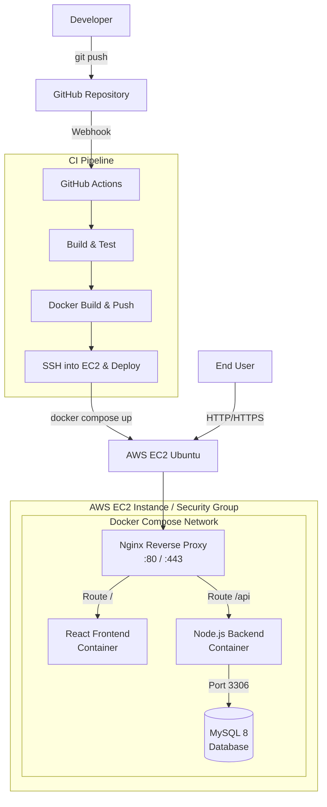

# Phase 1: Architecture and Planning

## 1. High-Level Architecture

The system utilizes a modern, containerized, three-tier architecture deployed on AWS. 



**Request Flow:**
1. **User Request**: A user visits the application domain. The request resolves to the AWS Elastic IP attached to our EC2 instance.
2. **Reverse Proxy (Nginx)**: The request hits Nginx (acting as a reverse proxy). Nginx terminates SSL (in future phases) and routes traffic.
3. **Frontend**: Requests matching `/` are routed to the React Frontend container.
4. **Backend**: Requests matching `/api` are routed to the Node.js API container.
5. **Database**: The backend container communicates with the MySQL container internally over the Docker bridge network on port 3306.

---

## 2. Repository Structure

A monorepo strategy is employed to keep all interconnected services versioned together, simplifying CI/CD and developer onboarding.

```text
multi-service-blog/
├── frontend/             # React application source code and Dockerfile
├── backend/              # Node.js/Express API source code and Dockerfile
├── database/             # Initial SQL scripts, schema definitions, and Dockerfile (if customized)
├── nginx/                # Nginx configuration files (nginx.conf, default.conf)
├── scripts/              # Bash scripts for DB backups, setup, or DB migrations
├── .github/
│   └── workflows/        # GitHub Actions CI/CD YAML configurations
├── docs/                 # Architectural documentation and runbooks
├── docker-compose.yml    # Main orchestration file for all services
├── .env.example          # Template for required environment variables
├── .gitignore            # Files and directories to ignore in Git
├── README.md             # Project overview and quick start guide
├── CONTRIBUTING.md       # Guidelines for developers contributing to the repo
└── CHANGELOG.md          # History of notable changes
```

**Why this structure?**
- **Isolation**: Each microservice manages its own dependencies and Dockerfile.
- **Orchestration at Root**: `docker-compose.yml` lives at the root, making it trivial to spin up the entire stack with `docker compose up`.
- **Infrastructure as Code**: Everything from code to CI pipelines (`.github`) to routing (`nginx`) is version-controlled in one place.

---

## 3. Service Design

- **Frontend**: A React application (built with Vite for speed) that will serve the UI. In production, the React build will be served statically by Nginx.
- **Backend**: A Node.js/Express REST API serving JSON. It handles authentication (JWT), business logic, and database connections.
- **Database**: MySQL 8. Used for robust, relational data storage (Users, Posts, Comments). 
- **Future Reverse Proxy (Nginx)**: Acts as the entry point for all traffic. It handles routing to the frontend or backend, rate limiting, and SSL termination.
- **Volumes**: 
  - A Docker named volume `mysql_data` will be attached to the MySQL container to persist data across container restarts.
- **Docker Networks**: 
  - A custom bridge network (e.g., `blog-network`) allows containers to resolve each other by container name (e.g., `http://backend:5000`).
- **Container Communication**: The frontend communicates with the backend via the reverse proxy (`/api`), preventing CORS issues. The backend communicates with the database entirely within the private Docker network; the database port is *not* exposed to the host machine for security.

---

## 4. Docker Architecture

- **Bridge Network**: All services will reside on a custom user-defined bridge network. This provides automatic DNS resolution between containers.
- **Named Volumes**: `mysql_data` will map to `/var/lib/mysql` inside the DB container. This ensures that destroying the container does not destroy the blog's data.
- **Container Dependencies**: `depends_on` will be heavily utilized. 
  - The backend depends on the database (and will wait for it to be healthy).
  - Nginx depends on both frontend and backend.
- **Health Checks**: 
  - MySQL will have a `healthcheck` pinging `mysqladmin`.
  - Backend will wait for the MySQL health check to pass before starting.
- **Restart Policies**: `restart: unless-stopped` will be used for all production services. If the EC2 instance reboots, Docker will automatically bring the application back online.
- **Ports**: 
  - Only Nginx exposes ports to the host (`80:80` and eventually `443:443`).
  - Database and Backend ports remain internal to the Docker network.
- **Development vs Production**: The root `docker-compose.yml` will be tuned for production. A `docker-compose.override.yml` (git-ignored) will be used locally to mount source code as bind mounts for hot-reloading.

---

## 5. Environment Variables

Environment variables are isolated per domain. See `.env.example` at the root of the repository for the exact schema.

- **Frontend**: `VITE_API_URL`
- **Backend**: `PORT`, `NODE_ENV`, JWT secrets (`JWT_SECRET`, `JWT_EXPIRES_IN`).
- **Database**: `DB_HOST`, `DB_USER`, `DB_PASSWORD`, `DB_NAME`, `DB_ROOT_PASSWORD`.
- **Docker**: `COMPOSE_PROJECT_NAME` for namespace isolation.

*Security Note: Hardcoded credentials are strictly forbidden. All secrets will be injected via GitHub Secrets during CI/CD.*

---

## 6. Git Strategy

We will utilize **Git Flow** (simplified) suitable for agile CI/CD:

- `main`: The production-ready branch. Code merged here automatically deploys to the AWS EC2 instance.
- `develop`: The active development branch. Feature branches merge here for integration testing.
- `feature/*`: Branched from `develop`. Used for new features (e.g., `feature/user-auth`).
- `hotfix/*`: Branched from `main`. Used for critical production bug fixes, merged back into both `main` and `develop`.

**Merge Workflow**: 
1. Branch from `develop`.
2. Commit changes.
3. Push and open a Pull Request (PR) against `develop`.
4. CI runs automated tests on the PR.
5. Peer review & Merge.

---

## 7. GitHub Repository Initialization

The repository has been successfully initialized with standard production-ready templates:
- `.gitignore`: Node, React, and OS-level ignore rules.
- `README.md`: Project summary.
- `LICENSE`: MIT License.
- `CONTRIBUTING.md`: PR and branching guidelines.
- `CHANGELOG.md`: Version tracking.
- `.env.example`: Secure environment variable template.

---

## 8. Docker Compose Planning

The eventual `docker-compose.yml` will feature:

- **Services**: `nginx`, `frontend`, `backend`, `database`.
- **Networks**: A dedicated `app-network`.
- **Volumes**: `db-data` for MySQL.
- **Health Checks**: Ensuring MySQL is ready before Node.js attempts a connection, preventing race-condition crash loops.
- **Scalability**: By keeping the backend stateless and storing sessions/tokens (JWT) securely, the Node.js backend can be horizontally scaled in the future if a load balancer is introduced.

---

## 9. AWS Planning

- **Why EC2?**: EC2 provides complete control over the host OS, making it perfect for learning and demonstrating Docker Compose orchestration, networking, and Linux administration.
- **OS**: Ubuntu 24.04 LTS (or 22.04 LTS) - industry standard for server environments.
- **Instance Type**: `t2.micro` or `t3.micro` (AWS Free Tier eligible, sufficient for initial stages).
- **Elastic IP**: A static IPv4 address will be attached so DNS records do not break upon instance restart.
- **Security Groups (Firewall)**:
  - Inbound Port 22 (SSH): Restricted to the Developer's IP address.
  - Inbound Port 80 (HTTP): Open to `0.0.0.0/0`.
  - Inbound Port 443 (HTTPS): Open to `0.0.0.0/0`.
  - All other ports (like 3306 or 5000) are BLOCKED from the outside.
- **IAM**: An IAM User with restricted programmatic access will be created strictly for GitHub Actions to perform deployments.
- **SSH Keys**: Ed25519 keys will be used for secure access.
- **Directory**: The project will be deployed to `/opt/multi-service-blog` or `/home/ubuntu/multi-service-blog`.
- **Linux User**: `ubuntu` (default). In stricter environments, a dedicated `deploy` user with limited sudo privileges is created.
- **Future SSL**: Let's Encrypt (Certbot) will be integrated with Nginx in a later phase.

---

## 10. CI/CD Planning

GitHub Actions will automate our delivery pipeline.

**Pipeline Flow on push to `main`**:
1. **Checkout Code**: GitHub Actions pulls the latest code.
2. **Lint & Test**: Run `npm test` on frontend and backend.
3. **Docker Build & Push (Optional but recommended)**: Build the images and push to Docker Hub or AWS ECR. (For simplicity in early phases, we can just build on the EC2 instance or pull from GHCR).
4. **SSH into EC2**: Using `appleboy/ssh-action` and GitHub Secrets (Private Key, Host IP).
5. **Deploy**: 
   - `git pull origin main`
   - `docker compose pull` (if using registries) OR `docker compose up -d --build`
   - `docker image prune -f` (Clean up old images to save disk space)

---

## 11. Milestone Checklist

- [x] **Phase 1: Architecture, Planning & Repo Initialization**
- [ ] **Phase 2: Backend Development (Node.js/Express, MySQL connection)**
- [ ] **Phase 3: Frontend Development (React Setup, API integration)**
- [ ] **Phase 4: Dockerization (Writing Dockerfiles and docker-compose.yml)**
- [ ] **Phase 5: Nginx Configuration & Local Orchestration Testing**
- [ ] **Phase 6: AWS EC2 Provisioning & Security Group Configuration**
- [ ] **Phase 7: Manual Deployment to AWS**
- [ ] **Phase 8: GitHub Actions CI/CD Pipeline Construction**
- [ ] **Phase 9: SSL/TLS Certificate Setup (HTTPS)**
- [ ] **Phase 10: Monitoring, Logging, & Final Polish**
